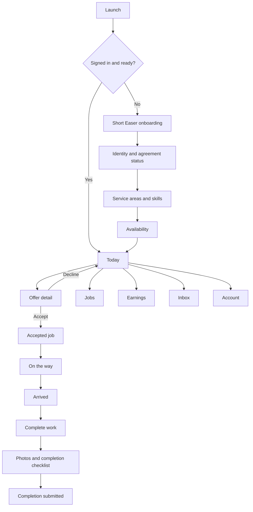

# Easer Native App Rebuild Audit — 2026-10-08

## Executive Summary

**Decision: stop treating the current TestFlight build as a release candidate.** It is a remote website inside a Capacitor shell (`mobile/capacitor.config.json` points to `https://www.assembleatease.com/app`). That is why it feels like a long website: its entry screen combines customer and Easer choices, then routes into existing browser pages.

The first real iPhone product should be **Easer by AssembleAtEase**, an Easer-only native app. Customer booking remains on the website until the customer app is designed as a separate native product. An Easer never has to choose between customer and worker modes in the app.

This is a P0 release issue. Apple’s App Review Guideline 4.2 says an app must go beyond a repackaged website. The current build also risks Easer confusion at the most important moment: opening the app to find and complete paid work.

## Evidence

| Finding | Evidence | Result |
| --- | --- | --- |
| The binary is a remote web shell | `mobile/capacitor.config.json` uses `server.url: https://www.assembleatease.com/app` | FAIL |
| First screen mixes two audiences | `app.html` presents “For your home” and “Work as an Easer” | FAIL |
| Navigation is browser-style | `native-app.js` injects Back / App home controls and hands some pages to Safari | FAIL |
| Existing Easer portal has useful domain capability | `/assembler/`, `/assembler/my-assignments`, `/assembler/payouts`, `/assembler/profile` contain dispatch, status, earnings and profile functions | PASS as backend/domain source, not as native UI |
| Job alerts are prepared | Firebase native messaging is configured and only registers an authenticated Easer | PASS, needs device proof after native rebuild |

## What a real Easer app is for

An Easer opens the app to answer one of five questions immediately:

1. Do I have a job offer right now?
2. Where do I need to be and when?
3. What do I earn for this job?
4. What action must I take next?
5. Am I ready and available for more work?

Everything on the first release serves one of those questions. There is no customer-booking content, marketing page, long policy text, or role switch in the working area.

## Native information architecture

Use five stable bottom tabs. Apple’s Human Interface Guidelines recommends a tab bar for top-level areas and keeping the same tabs present while moving within the app.

| Tab | Purpose | First screen content |
| --- | --- | --- |
| **Today** | The work that matters now | Availability control, urgent offer, active job, next job, short readiness card |
| **Jobs** | Offers and schedule | Segmented view: Offers / Upcoming / Past. Each row shows date, area, service, estimated time and Easer earnings. |
| **Earnings** | Clear pay visibility | This week, pending, paid, payout history. Never show the customer’s total. |
| **Inbox** | Work communication | Job-specific messages and dispatch updates, sorted newest first. |
| **Account** | Profile and work settings | Service area, skills, availability, documents, support, sign out. |

A notification opens the exact job, never a generic browser page.

## Screen map

## Critical layouts

### 1. Today — the home screen

This is a decision screen, not a dashboard full of cards.

- Header: “Today” and notification bell.
- One availability switch: **Available** / **Paused**.
- If there is an offer, one dominant offer card: earnings, distance/area, start time, service, estimated duration, time left to respond; **View offer** button.
- If there is an active job, it replaces offers at the top and contains one primary action: **Start travel**, **I arrived**, or **Complete job**.
- If nothing is active: calm empty state: “You’re available. New matching work will appear here.”
- A small readiness card appears only when an actual required step blocks offers.

### 2. Offer detail

A full-screen detail view, not a long scrolling sales page.

Top section, visible without scrolling:

- Easer earnings
- Date and arrival window
- Approximate travel area before acceptance; exact address once the policy allows it
- Service and item summary
- Estimated duration
- Required tools / access notes
- Countdown if the offer expires

Sticky bottom actions: **Decline** and **Accept job**. The acceptance endpoint remains server-authoritative and idempotent.

### 3. Active job

The app’s most important screen. It is task-based and uses one next action.

- Map / directions button
- Customer contact only when the existing server release rule permits it
- Job requirements and photos
- Progress state: Accepted → On the way → Arrived → Complete
- One fixed primary action at the bottom
- Report an issue as a secondary action

### 4. Completion

Use a short checklist, camera-first proof upload, optional note, and a single **Submit completion** action. Preserve existing server checks for assignment ownership, evidence, payment/capture workflow, and owner visibility. Do not allow the native UI to invent a completion state.

### 5. Onboarding

Use a short, progressive checklist:

1. Create account
2. Sign agreement
3. Verify identity
4. Add service area and skills
5. Set availability

Show only the next required action. Do not put privacy policy, terms, app explanations, or all account setup in front of the first useful screen. Apple recommends brief, focused onboarding and contextual guidance.

## Privacy and permissions

The comparison to Tasker is valid: a work app should not open with a wall of privacy content. The native app needs straightforward explanations only at the moment a permission is useful:

| Permission | Ask only when | Plain pre-permission explanation |
| --- | --- | --- |
| Notifications | After an approved Easer turns availability on | “Get alerts for new work and schedule changes.” |
| Location | When the Easer taps **I arrived** | “Share your location once to confirm arrival. You can still check in another way.” |
| Camera | When adding completion photos | “Take photos of the completed work.” |
| Photo library | When choosing existing job photos | “Choose photos to attach to this job.” |

Privacy Policy and Terms belong in Account and the App Store listing. They should not be front-and-center during work flow. The current iOS permission strings are acceptable starting copy, but the native flow must request them contextually.

## What remains server-backed

A native UI rebuild must reuse the existing domain/API truth, not duplicate it:

- Easer readiness and approval
- Offers, acceptance, decline and expiry
- Assignment ownership
- Exact address/contact release rules
- Arrival verification
- Completion evidence
- Easer earnings, payout status and payout history
- Notification registration and sign-out unregistration

The mobile client may render the state and trigger an authenticated request. It must never calculate earnings, mark a job complete, or treat an action as successful without the server response.

## Build status (2026-10-08, continued after the first draft)

The first draft (a single SwiftUI file) was not compiled and did not match the server: it read earnings fields that do not exist (`pending_cents`), wrote availability straight to the profiles table, kept the session in plain app storage with no refresh, had no completion photo or "On the way" step, and no push, location or account closure. It was replaced. What is built now, in `mobile/ios/App/App/`:

| Area | Built |
| --- | --- |
| Entry | Native SwiftUI root (`SceneDelegate.swift`); no web view, no storyboard, no customer/Easer chooser |
| Sign in | Same Supabase project and public key as the website; Easer accounts only; session in the Keychain with automatic refresh; forgot password and apply open in Safari |
| Tabs | Today, Jobs (Offers / Upcoming / Past), Earnings, Inbox, Account |
| Today | Availability switch with the web's readiness, suspension and closure checks; setup card only when a step blocks offers; active job, offers with time left, next job |
| Job | Estimated earnings, area before acceptance and address after, items, notes, directions, call and messages once accepted; one action at a time: Accept / Decline, Start travel, I've arrived, Start job, Complete job |
| Completion | Camera or library photo, shrunk to the server's limits, uploaded as `completion_photo`, then completion; a retry never re-uploads |
| Earnings | Awaiting payout, paid, on hold, total, history with the server's own status wording |
| Inbox | Server notifications; tap opens the job and marks it read |
| Account | Availability, job alerts, profile and payouts (Safari), help, legal, sign out, close account (in-app request) |
| Permissions | Notifications when going online; location only on "I've arrived" (optional); camera only when adding a photo |
| Push | Firebase Messaging used natively; token registered for a signed-in Easer, removed on sign-out; tapping an alert opens the job |
| App Store | iPhone only, portrait, iOS 17+, privacy manifest, display name "Easer" |

Contract guard: `scripts/test-easer-native-app.mjs` (in `npm run test:launch`) fails if an endpoint or field the app reads stops existing, if upload limits drift, or if the app starts writing a business rule the server owns.

Not yet proven: the Swift has not been compiled (no Mac here; Codemagic is the compiler) and nothing has run on a real iPhone. Android still ships the web shell.

## PASS / WARNING / FAIL Matrix

| Area | Result | Reason |
| --- | --- | --- |
| Native app identity | FAIL | Remote website shell, not a native product |
| Easer focus | FAIL | Customer and Easer choices mixed on launch |
| Work discovery | WARNING | Existing portal supports work content but needs native offer-first screens |
| Job execution | WARNING | Existing backend/workflow can be reused; interface is browser-oriented |
| Earnings clarity | WARNING | Existing payout pages exist; must be consolidated into a native earnings tab |
| Notifications | WARNING | Native setup exists; device behavior needs real testing |
| Permission experience | WARNING | Permission strings exist; contextual flow has not been built |
| Customer booking in Easer app | FAIL | It distracts from Easer work and confuses role boundaries |
| App Review readiness | FAIL | Current design risks Apple Guideline 4.2 rejection |

## Fix order

1. **P0 — Remove the current web-shell app from external TestFlight / App Store release path.** Keep it for internal technical experiments only.
2. **P0 — Rebuild the iOS client as Easer-only native screens.** No `/app` customer/Easer chooser and no remote website as the primary interface.
3. **P0 — Make the Today → Offer → Active Job → Completion path work end to end with the existing APIs.** Test no offer, offer received, accept, decline, on-the-way, arrival, photo completion, failure and retry.
4. **P1 — Build Jobs, Earnings, Inbox and Account as native tabs.**
5. **P1 — Add contextual native permissions and deep links from job notifications.**
6. **P1 — Give the future customer app its own UX and release plan.** It should not be bolted into the Easer application.
7. **P2 — Revisit public app naming and screenshots once the rebuilt product is testable.** Recommended product name: **Easer by AssembleAtEase**; AssembleAtEase can remain the company name.

## Test plan before any Apple review

| Workflow | Required proof |
| --- | --- |
| First launch | Easer sees sign-in or short onboarding, never customer booking |
| Approved Easer | Today shows availability and correct next work state |
| Offer | Correct earnings, location policy, expiry, accept/decline behavior |
| Job lifecycle | One action at a time; server status and owner timeline agree |
| Completion | Photo upload and submission failure recover without duplicating completion |
| Earnings | Estimated versus final earnings and payout status match the server ledger |
| Notifications | Notification opens the intended authenticated job screen |
| Permissions | No prompt before the related action; denied permission has a usable fallback |
| Security | Direct links and mutations reject a different Easer |
| Offline | Clear offline state; queued/retried behavior does not fake completion |

## Sources

- Apple, App Review Guidelines 4.2: apps must be more than a repackaged website.
- Apple, Human Interface Guidelines: Tab bars, Onboarding, Lists.
- Apple, TestFlight documentation: internal testing is appropriate before external beta review.
- Taskrabbit official Tasker documentation: provider work uses a distinct Tasker app and work availability/scheduling.

## Launch recommendation

**Do not submit the current build for App Store or external TestFlight review.** It is suitable only as a technical build proof. The next private TestFlight build should be the Easer-only native app after the Today-to-completion workflow passes on a real iPhone.
